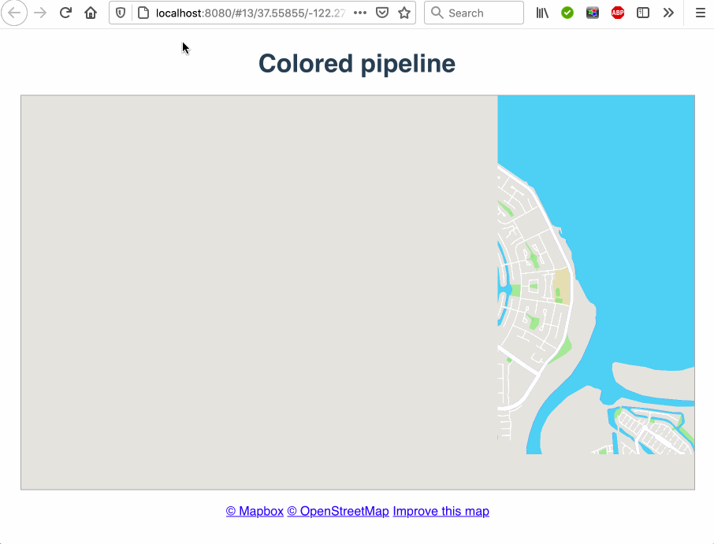

## Getting Started

- Have [Node](https://nodejs.org/en/download/) installed.
- Run the following command from where is planning to have the project installed:

```
git clone git@github.com:votoznotna/fracta-home.git
```

```
go fracta-home directory
```

- From the same folder run

```
npm install
```

```
npm start
```

- Navigate http://localhost:8080/ (or first available port after 8080) in browser and enjoy the run.


